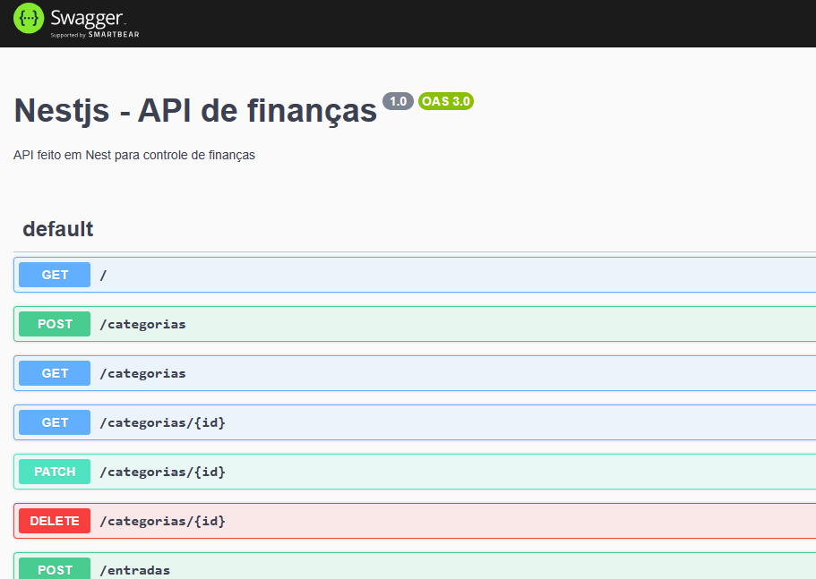

<h1 align="center">
  API De Finanças criada utilizando <i> NestJs </i>
  <a href="http://nestjs.com/" target="blank"></a>
</h1>

## Documentação

A utilização da API do Nest.JS foi documentada utilizando o Swagger. Para iniciar a API acesse a URL `http://localhost:3000/api`



## Iniciar a aplicação

```bash
# Baixar as dependências
npm install

# Iniciar o container mysql com o user root e o password 123
docker compose up

# Iniciar o servidor nest no ambiente de desenvolvimento na porta 3000
npm run start
```

## Tecnologias

## Anotações de Estudo

### Principais Comandos

#### Nest Js

- `npm run start:dev`: iniciar o nest no ambiente de desenvolvimento
- `nest generate module categorias`: criar um módulo de categorias para agrupar o contexto de uma feature, no exemplo acima, feature de categorias
- `nest generate resource categorias`: criar todos os recursos (todos os métodos http do REST, ou GraphQL, micro-serviço, etc) de uma feature, podendo criar todos os entry points do CRUD
- `nest g service prisma`: gerar um serviço prisma

#### Docker

- `docker compose up`: criar e inicia todos os containers do Docker (do arquivo `docker-compose.yaml`) para rodar o MySQL
- `docker compose exec db bash`: executar um comando dentro de um container, no cenário: dentro do db, executar o comando bash

#### Container com MySQL

- `mysql --password`: acessar o mysql com o password, que será digitado depois
- `SHOW DATABASES;`: listar todos os banco de dados
- `use nestjs;`: utilizar o banco de dados 'nestjs'
- `show tables;`: listar todos as tabelas
- `describe Categoria`: descrever a estrutura da tabela

#### Prisma

É uma ORM para modelagem de dados

`npm install @prisma/client`: instalar o prisma client
`npx prisma init`: iniciar o prisma dentro da pasta raiz
`npx prisma migrate dev`: criar uma migração (versionamento) para o banco de dados
`npx prisma studio`: ferramenta que abre no browser para visualizar e manipular os dados dos banco de dados

[Nest](https://github.com/nestjs/nest) framework TypeScript starter repository.

## Rodando a aplicação

```bash
# aplicação no ambiente de desenvolvimento
$ npm run start

# aplicação no ambiente watch mode (observação)
$ npm run start:dev

# aplicação no ambiente de produção
$ npm run start:prod
```

## Testes

```bash
# Rodar testes unitários
$ npm run test

# Rodar testes e2e
$ npm run test:e2e

# Ver cobertura dos testes
$ npm run test:cov
```

## Anotações

### Diferença entre os métodos HTTP: Patch x Put

- `PUT`: Atualizar o recurso por **completo**, é obrigado a passar **TODOS** os dados
- `PATCH`: Atualização **parcial**, passar todos os dados, ou apenas um único grupo de dados

### Nest Repl

É possível rodar um ambiente REPL (Read-Eval-Print-Loop) para testar o back-end do nest pelo terminal, você pode chamar os métodos dos providers e controllers pelo terminal.

Você cria um arquivo repl.ts e testa usando o comando `npm run start -- --entryFile repl`

```ts
// repl.ts
import { repl } from '@nestjs/core';
import { AppModule } from './app.module';

async function bootstrap() {
  await repl(AppModule);
}

bootstrap();
```
